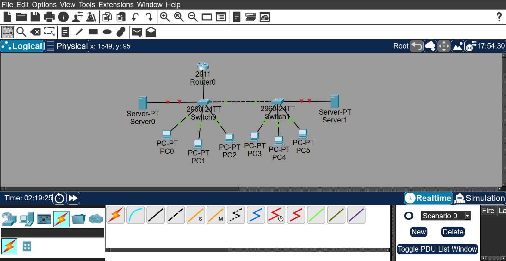
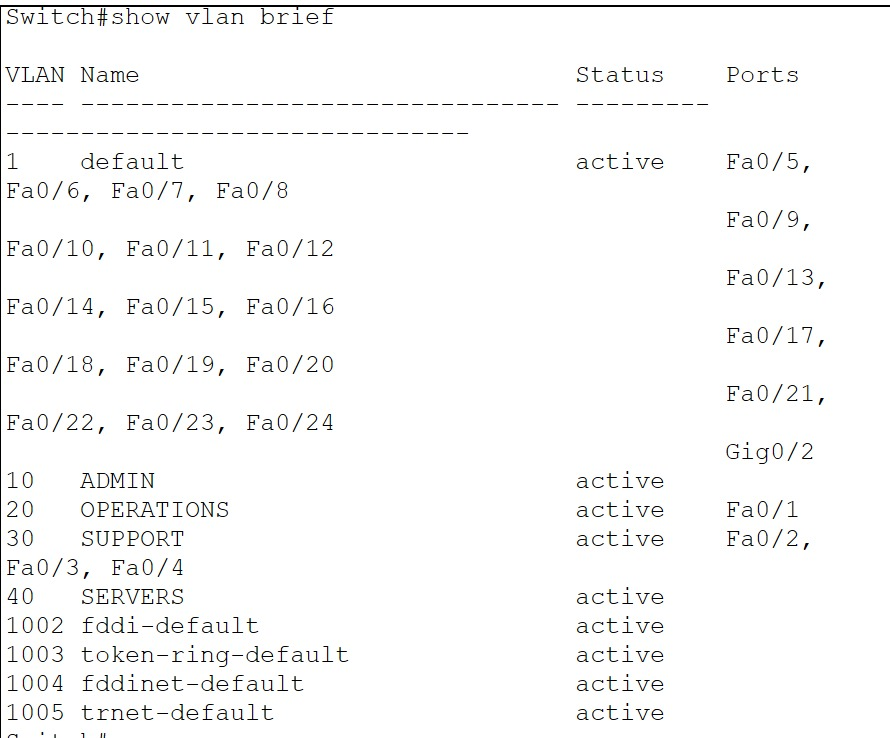
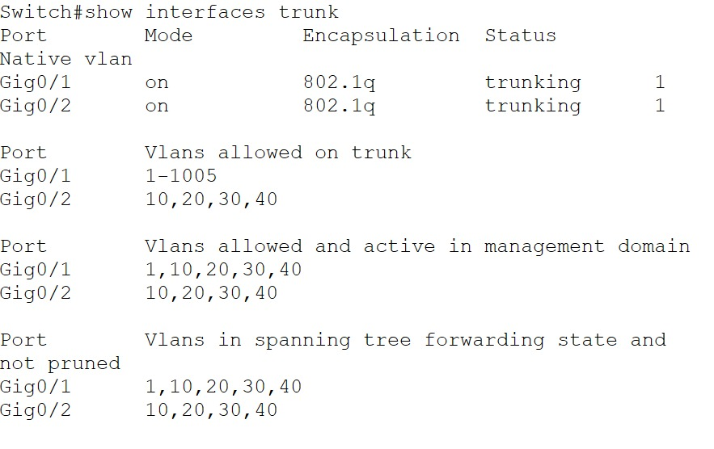
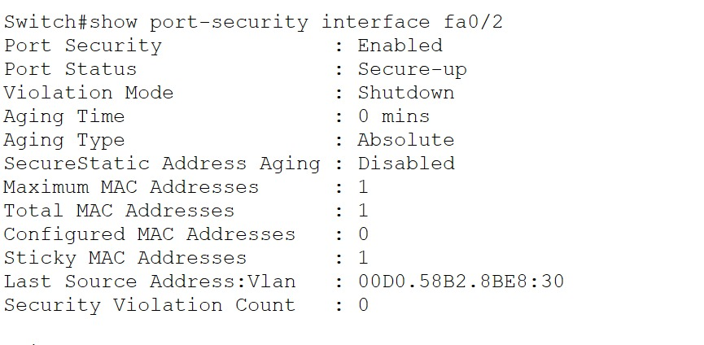
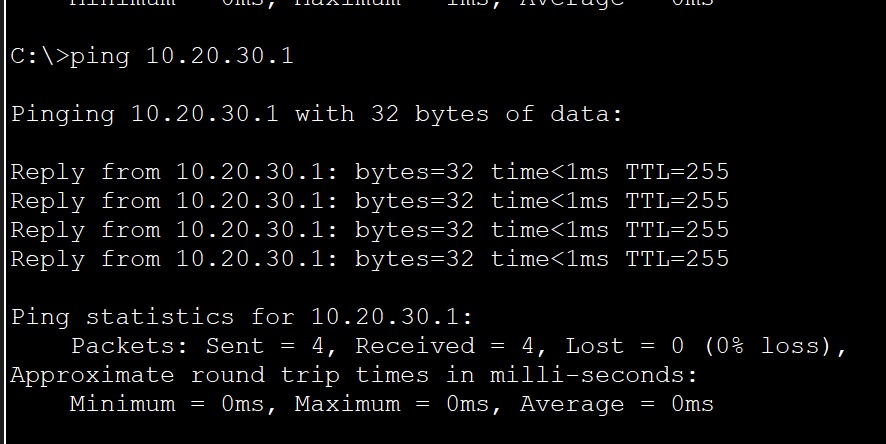

# Branch Network Incident & Recovery

## Project Overview

This Cisco Packet Tracer project focuses on network troubleshooting, incident analysis, security response, and service recovery.

Instead of only building a working network, I created a healthy branch network baseline and then introduced several intentional faults and security incidents.

For each incident, I followed a structured troubleshooting process:

**Failure → Diagnosis → Evidence → Fix → Verification**

---

## Business Scenario

A company branch network supports three user departments and an internal server environment:

- Admin
- Operations
- Support
- Servers

The network initially operates normally. Multiple configuration errors and security incidents are then introduced to simulate issues that a network engineer may need to diagnose and recover from.

---

## Network Topology

The environment includes:

- 1 Cisco 2911 Router
- 2 Cisco 2960 Switches
- 6 Client PCs
- 1 Internal Server
- 1 temporary Rogue DHCP Server used for the security incident

---

## VLAN Design

| VLAN | Department |
|---|---|
| 10 | ADMIN |
| 20 | OPERATIONS |
| 30 | SUPPORT |
| 40 | SERVERS |

---

## IP Addressing

| VLAN | Network | Default Gateway |
|---|---|---|
| ADMIN | 10.20.10.0/24 | 10.20.10.1 |
| OPERATIONS | 10.20.20.0/24 | 10.20.20.1 |
| SUPPORT | 10.20.30.0/24 | 10.20.30.1 |
| SERVERS | 10.20.40.0/24 | 10.20.40.1 |

Client devices use DHCP.

The internal server uses a static IP address:

`10.20.40.10/24`

---

## Technologies Practiced

- VLAN segmentation
- 802.1Q trunking
- Router-on-a-Stick
- Inter-VLAN routing
- DHCP
- Static server addressing
- Port Security
- Sticky MAC addresses
- Switchport troubleshooting
- Trunk troubleshooting
- Connectivity testing
- Incident recovery

---

# Incident 1 — Wrong VLAN Assignment

A device in the Operations department lost connectivity to its gateway.

### Diagnosis

Using:

`show vlan brief`

I discovered that the device's access port had been incorrectly assigned to VLAN 30 instead of VLAN 20.

### Resolution

The switchport was reassigned to the correct VLAN and the client renewed its DHCP configuration.

Connectivity was then successfully restored.

---

# Incident 2 — Rogue DHCP Server

A temporary unauthorized DHCP server was connected to the Support VLAN.

The rogue server distributed incorrect network settings including:

- Incorrect default gateway
- Unauthorized DNS server
- Rogue DHCP addresses

### Diagnosis

A client received network configuration that did not match the company's legitimate DHCP configuration.

### Response

The rogue DHCP server was identified and its switchport was administratively shut down, isolating the unauthorized device from the network.

The legitimate DHCP service was restored and client connectivity was verified.

---

# Incident 3 — Trunk VLAN Misconfiguration

Support VLAN users lost access to their gateway.

### Diagnosis

Using:

`show interfaces trunk`

I identified that VLAN 30 had been accidentally removed from the allowed VLAN list on the trunk between the two switches.

### Resolution

VLAN 30 was restored to the trunk allowed VLAN list.

Connectivity returned after the network reconverged.

---

# Incident 4 — Unauthorized Device / Port Security Violation

Port Security was configured on a user access port using sticky MAC address learning.

The authorized device was disconnected and replaced with an unknown device.

The switch detected the MAC address violation and automatically placed the port into:

`secure-shutdown`

The violation counter increased to:

`1`

### Recovery

The unauthorized device was removed, the original authorized device was restored, and the interface was manually recovered.

---

## Final Verification

After resolving the incidents, connectivity to the Support VLAN gateway was successfully restored.

---

## Commands Used for Verification

Examples of verification commands used during troubleshooting:

`show vlan brief`

`show interfaces trunk`

`show port-security interface fa0/2`

`show ip dhcp pool`

`show ip dhcp binding`

`show ip dhcp conflict`

`show ip interface brief`

`ping`

---

## Project File

The Cisco Packet Tracer file is included in this repository:

`Branch_Network_Incident_Recovery.pkt`

---

## What I Practiced

This project helped me practice thinking beyond basic device configuration.

I worked through identifying symptoms, collecting evidence, isolating faults, applying fixes, and verifying that network services were restored.

The project was built as part of my practical CCNA learning and networking portfolio.
